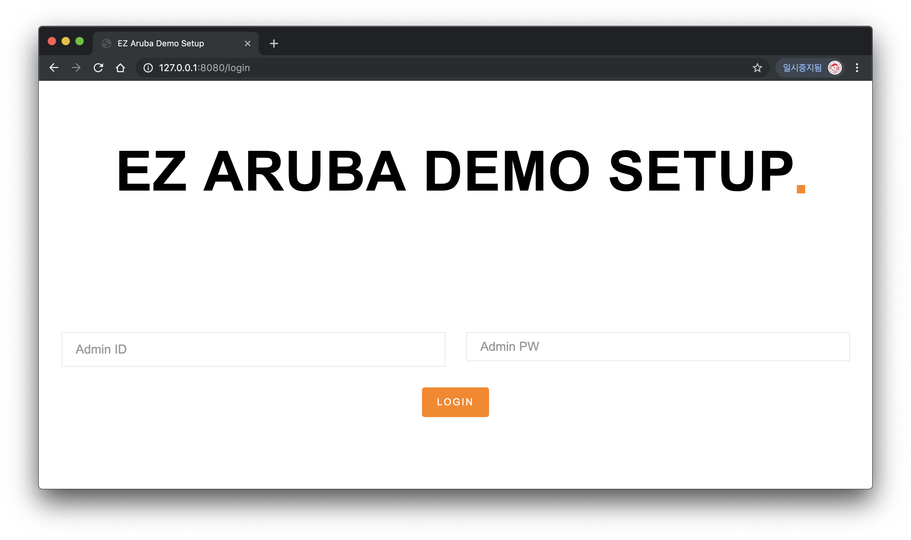
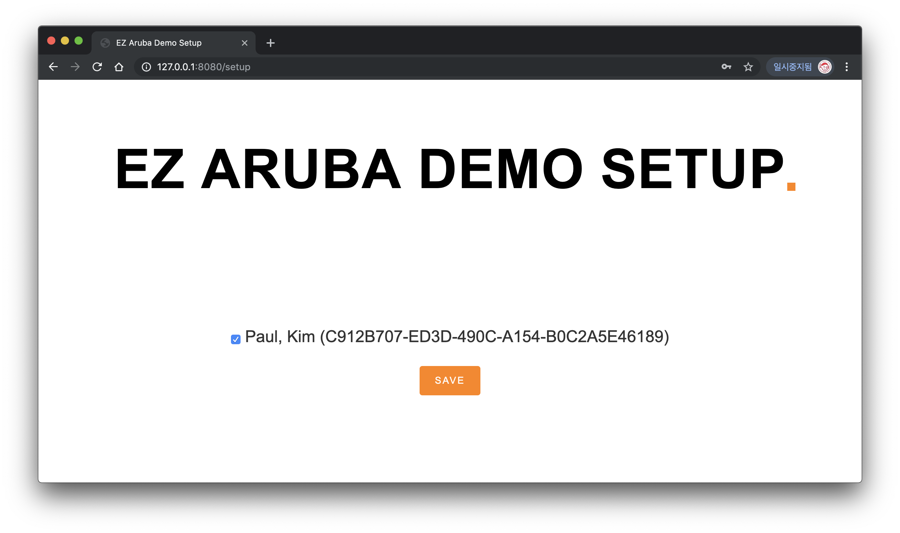

# EZAruba (Meridian - SoluM API Integration)

### Installation
<pre>git clone https://github.com/aruba-paulkim/EZAruba-SoluM.git
python3 -m venv EZAruba-SoluM
cd EZAruba-SoluM
source bin/activate
pip install -r requirements.txt</pre>

### Run
<pre>python app.py</pre>

